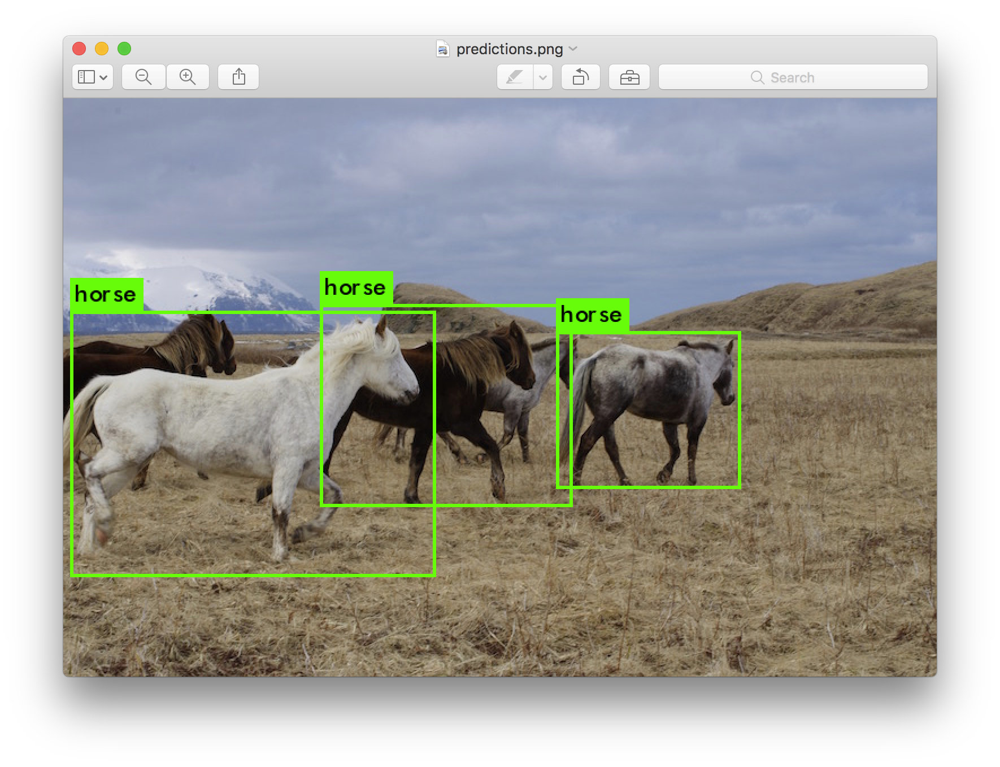

# Traffic Counter

Simple implementation of YOLO algorithm to count the number of vehicles in an image.

It sets up a TCP server so it can communicate between the script that will actually do the vehicle counting and another script that will do some form of processing based on the result. The input image is read from the system webcam and then fed to the algorithm to create the bounding boxes for the detections. Then checks their labels and classifies the cars present.

Download the weight values from [https://pjreddie.com/media/files/yolov3-tiny.weights](https://pjreddie.com/media/files/yolov3-tiny.weights) (33.8mb). There is also a larger version of 237mb which can be downloaded from [https://pjreddie.com/media/files/yolov3.weights](https://pjreddie.com/media/files/yolov3.weights)

You can read more about YOLO here [https://pjreddie.com/darknet/yolo/](https://pjreddie.com/darknet/yolo/)

